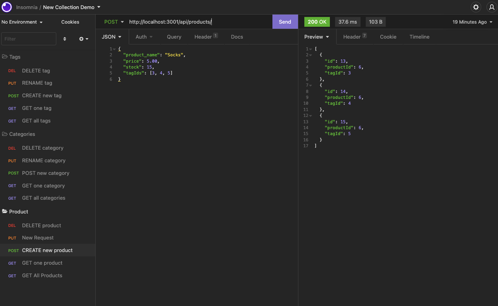
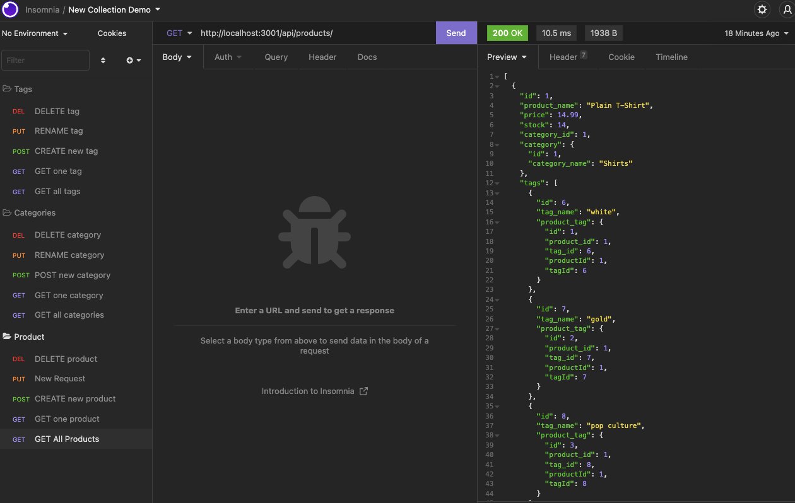

# E-Commerce Back-End

  
  

  ## Description
  This project creates the back end for an e-commerce app utilizing Express.js and Sequelize to interface with a MySQL database. This creates a database using MySQL through models and associations, and also demonstrates API routes to perform RESTful CRUD operations. Functionality of this app can be viewed in the walkthrough videos below.
  
  ## Table of Contents
  - [Installation](#installation)
  - [Usage](#usage)
  - [Contributing](#contributing)
  - [License](#license)
  
  ## Installation
  First, clone the repository from GitHub, and ensure you've run an `npm install` against the package.json. Create and update.envEXAMPLE file with your own password credentials for MySQL. Then, connect to the mySQL database by running `mysql -u root -p` and enter your .env password there. Run `source schema.sql`. Seed the file by running `npm run seed` from your root directory. Finally, connect to the server by running `npm start`.
  
  ## Usage
  This application allows users to view, add, edit, and delete categories, products, and tags.

  - View the [MySQL walkthrough video](https://drive.google.com/file/d/1nFvitU2LeS1bwf_S4-OzfekiAePTl17M/view)
  - View the [API and Insomnia walkthrough video](https://drive.google.com/file/d/1Oq6a6LyFhuD3mjjn4Co4ZfRlxlkI9Du3/view)

  
  
  
  ## License
  Read more about MIT here: [MIT](https://opensource.org/licenses/MIT)
  
  ## Contributing
  Please read the installation section.
  
  ## Tests
  None
  
  ## Questions
  - GitHub: [View my profile](https://github.com/ajolsavsky)
  - Email: alexandraolsavsky@gmail.com
  